# BE FIT
  <a href="https://github.com/Winnie59/BeFit">
    
  </a>

# Description 
BE FIT is a helpful workout application where those who enjoy working out and training can create, edit and delete a daily schedule  or choose from our weekly workout plans. They can also shop for health and wellness products.

* Start with the home page. From this page user can get started by choosing base on their interest.


* BE FIT page. This page has options to create your daily plan or choose any weekly plans that BE FIT provided.


* Weekly Plans. There are 3 plans starter, strong and super. These plans will have a weekly sample workouts for user to complete them daily.


* Create your own daily plans. User has to become member first to use this page. 

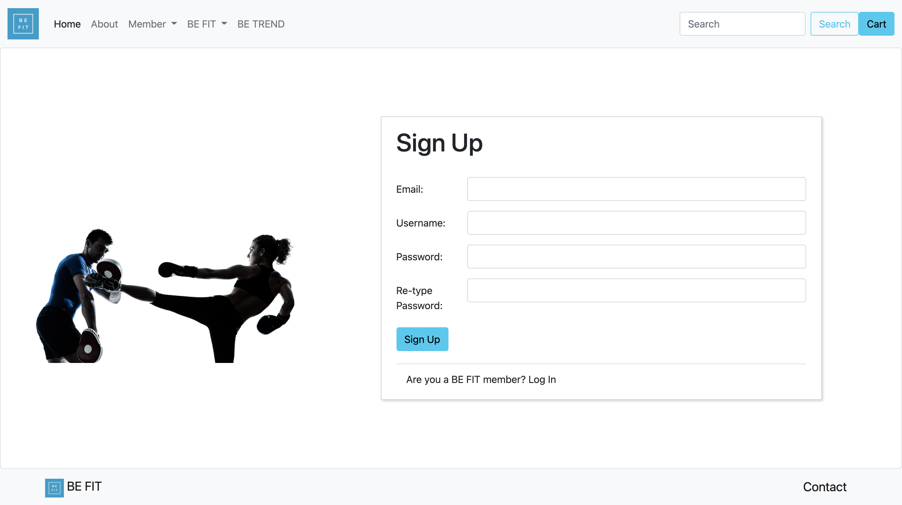

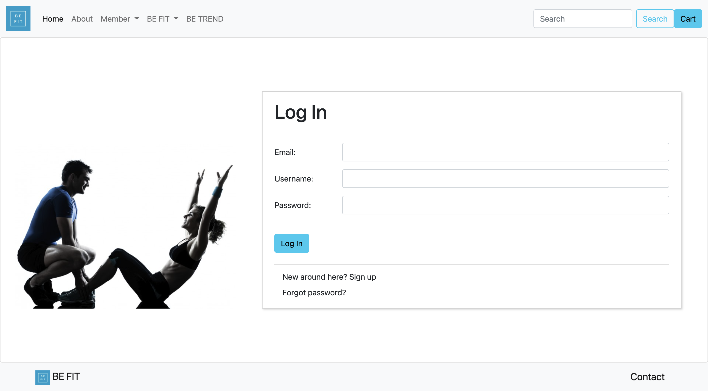

* After sign up, log in and create profile, then user will be able to create their own daily plans.

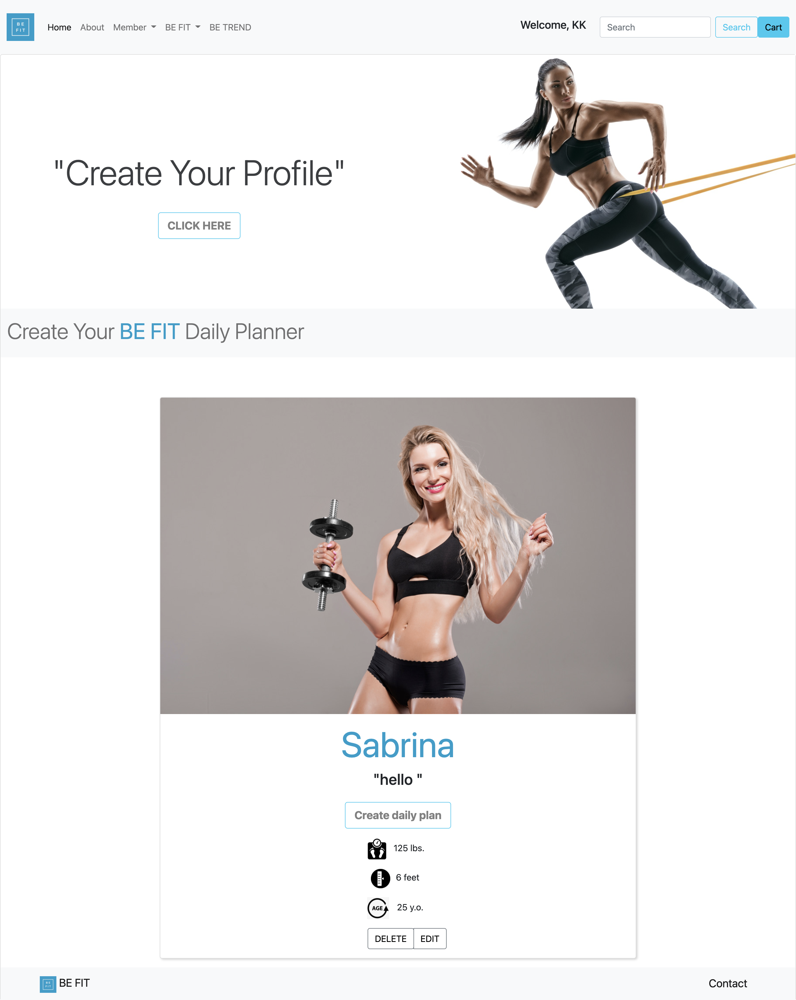

* The plan has to complete before in order to see details and complete on the next one.

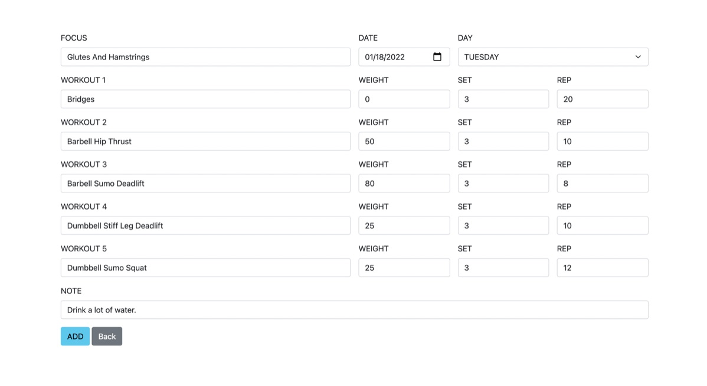


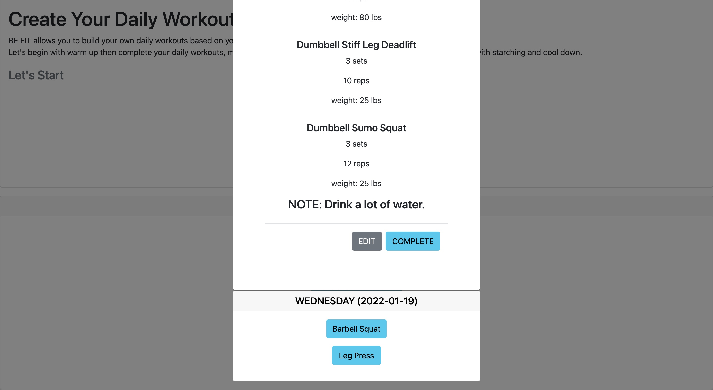

* BE TREND is the page that user can find and purchase the health and wellness products in this case we are using products from BECOME nutrition. 

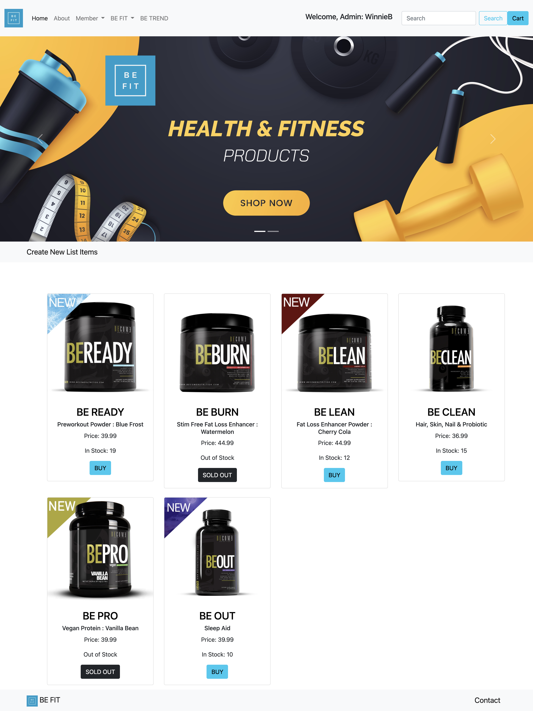

* Only Admin is allowed to create, edit and delete the products from this page.

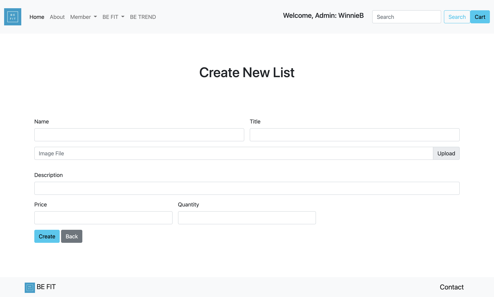

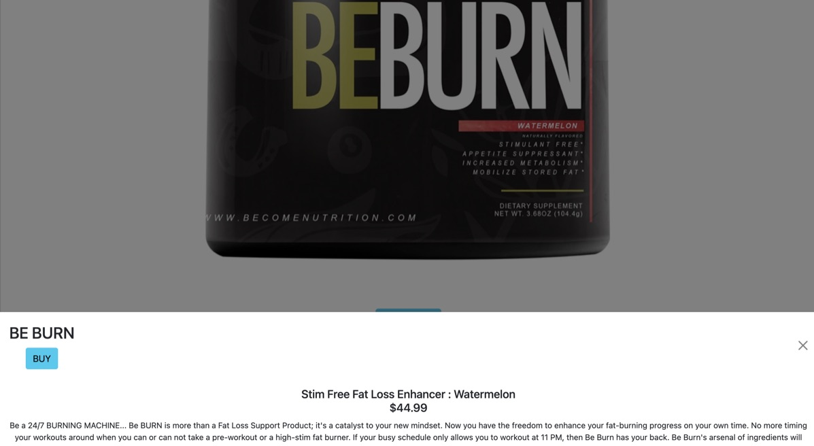

# Built With
* [Node.js](https://nodejs.org/)
* [Express.js](https://expressjs.org/)
* [EJS](https://ejs.co/)
* [HTML5](https://svelte.dev/)
* [CSS](https://sass-lang.com/)
* [Bootstrap](https://getbootstrap.com)
* [Javascript](https://developer.mozilla.org/en-US/docs/Web/JavaScript)
* [MongoDB](https://www.mongodb.com)
* [Mongoose](https://mongoosejs.com)

# Installation instructions
1. Clone the repo
   ```sh
   git clone https://github.com/Winnie59/BeFit
   ```
2. Install all NPM packages
   ```sh
   npm install

# User Story
- As a user, I should be able to log in and create my own profile.
- As a user, I should be able to choose any workouts plans base on my interest.
- As a user, I should be able to view, edit and delete my daily plans.
- As a user, I should be able to complete my workout.
- As a user, I should be able to shop on the health and wellness products
- As a user, if I was admin. I sould be able to ceate, edit and delete the products list.

# Wire Frames
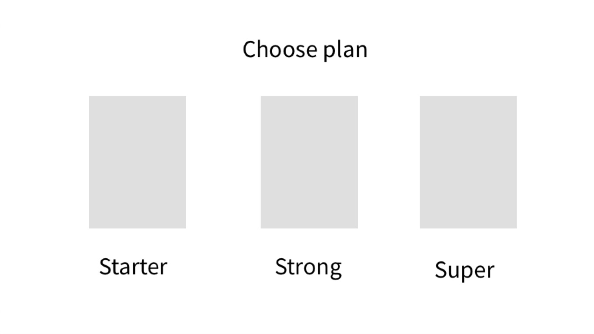

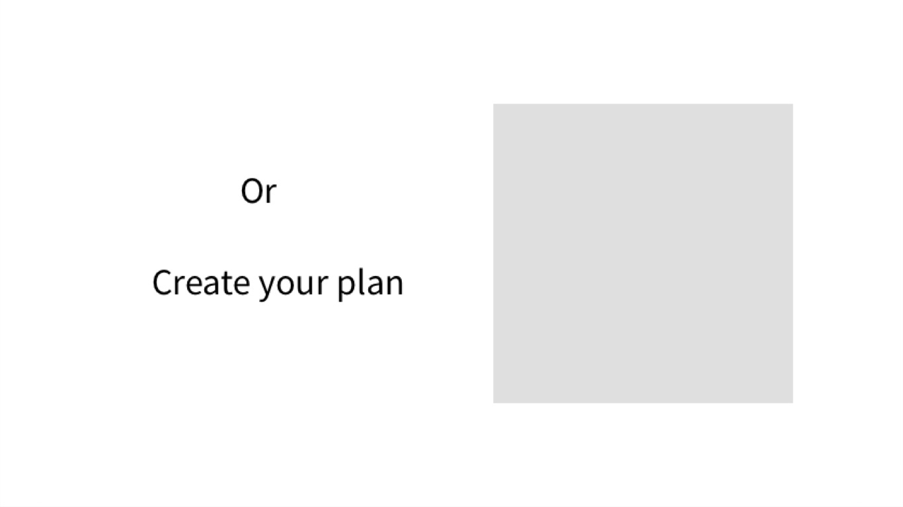

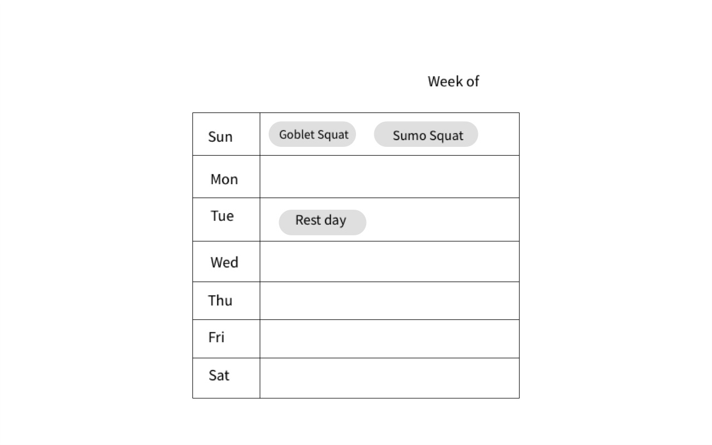

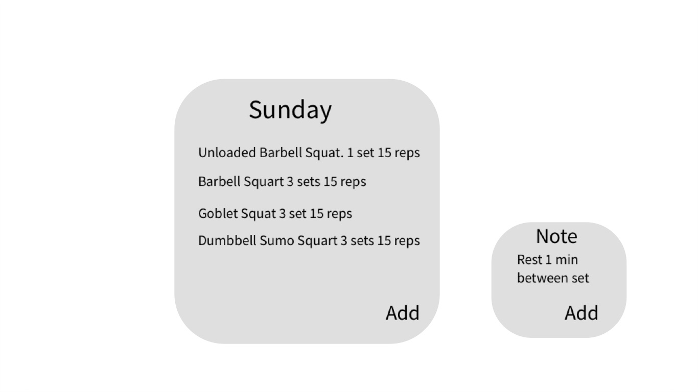

# Contact

Winnie Bolm 
* [Winnie Bolm LinkedIn](https://www.linkedin.com/in/winniebolm/) 
* winnie.bolm@gmail.com

# Improvement
- Complete on forgot password part.
- Using API, user can choose their workout list from API instead of writing them out.
- Add more data on weekly workout plans and make them randomly update each week. Also make it for user can be able to edit them.
- Add the notifications for user can get update on thier workout plans
- Use Multer to help upload image file.
- Complete on cart, order and purchash route on BE TREND selling page.
- Complete on seach bar function.
